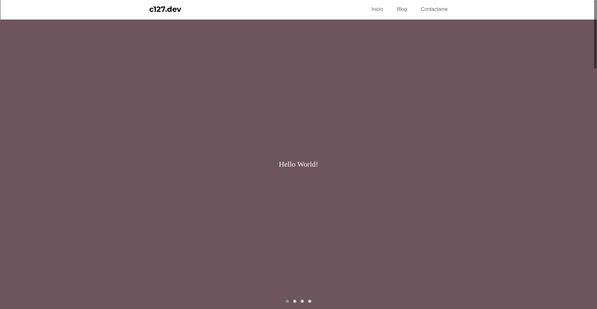

# My Web Page

Hola, recomiendo usar algun servicio para ver la pagina web como:

ExpressJS:
```javascript
const express = require('express');
const app = express();
const path = require('path');

app.use(express.static(path.join(__dirname, 'www')));

app.listen(3000, () => {
    console.log('Server is running at http://localhost:3000');
});
```

Python:
```bash
python -m http.server
```

o XAMMP

